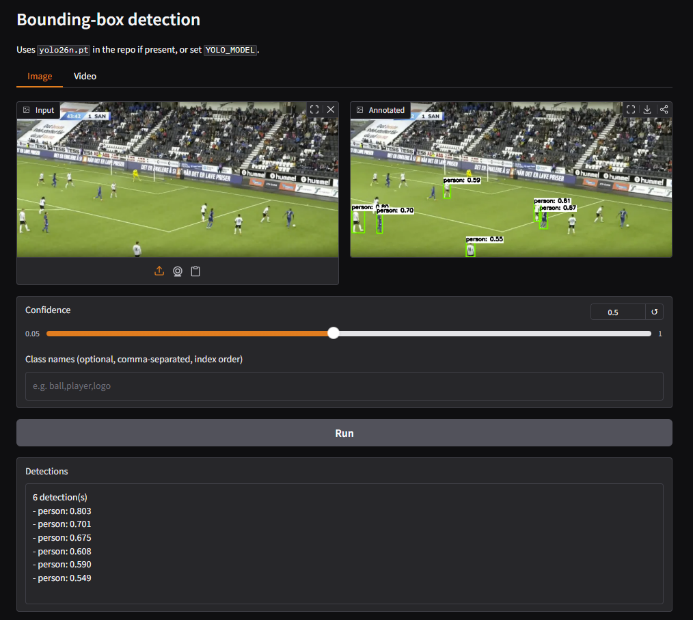
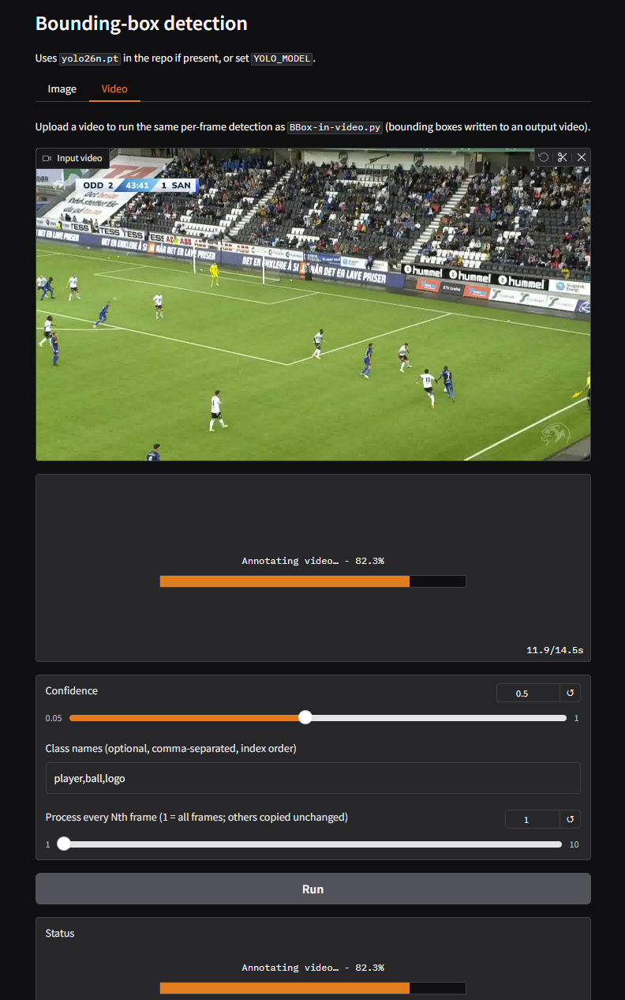

# YOLO PredictBOX

[](https://www.python.org/downloads/)
[](LICENSE)

Draw **bounding boxes** on video using **Ultralytics YOLO** and **OpenCV**. The default weights file is **`models/yolo26n.pt`** (override with `-m` or `YOLO_MODEL`). Optional **FastAPI** and **Gradio** endpoints are included for still-image inference.

---

## Features

- **Video** from a local file or an **m3u8** URL (requires [ffmpeg](https://ffmpeg.org/) on your `PATH`)
- Default model path: **`models/yolo26n.pt`** (no `-m` needed if that file exists)
- **FastAPI** `/detect` endpoint (multipart image upload)
- **Gradio** web UI with **Image** and **Video** tabs (upload, run detection, view annotated output; video shows progress while processing)
- Portable paths — no hardcoded machine-specific directories

---

## Requirements

- Python 3.10+
- **`models/yolo26n.pt`** in the `Bounding-Box` directory (or pass another `.pt` with `-m` / `YOLO_MODEL`)
- For video from m3u8: **ffmpeg** installed and available on `PATH`

---

## Installation

```bash
cd Bounding-Box
python -m venv .venv
# Windows: .venv\Scripts\activate
# Linux/macOS: source .venv/bin/activate
pip install -r requirements.txt
```

---

## CLI (video)

Run from the `Bounding-Box` directory.

**Default model:** if `models/yolo26n.pt` is present, you can omit `-m`.

From a file:

```bash
python cli.py video -i clip.mp4 -o outputs/annotated.mp4 --skip-frames 1
```

Explicit weights:

```bash
python cli.py video -m models/yolo26n.pt -i clip.mp4 -o outputs/annotated.mp4
```

From an m3u8 stream (downloads a temporary MP4 with ffmpeg, then runs detection):

```bash
python cli.py video --m3u8-url "https://example.com/stream.m3u8" -o outputs/annotated.mp4
```

Use `--codec mp4v` or `--codec XVID` if the output does not open in your player.

### Class name labels

Optional comma-separated names in **dataset class index order**:

```bash
python cli.py video -i clip.mp4 -o out.mp4 --class-names "player,ball,logo"
```

---

## Legacy script `scripts/BBox-in-video.py`

Uses **`models/yolo26n.pt`** and writes to **`outputs/annotated.avi`**. By default it reads **`samples/Original.mp4`** when **`M3U8_URL`** is empty; change **`INPUT_VIDEO`** or **`M3U8_URL`** at the top of the script, or prefer the CLI above.

```bash
python scripts/BBox-in-video.py
```

---

## FastAPI

If **`models/yolo26n.pt`** exists, you can start the server without setting `YOLO_MODEL`:

```bash
python run_api.py
```

To use another weights file:

```bash
$env:YOLO_MODEL="D:\path\to\other.pt"   # Windows PowerShell
python run_api.py
```

```bash
export YOLO_MODEL=/path/to/other.pt   # Linux / macOS
python run_api.py
```

- `GET /health` — liveness check  
- `POST /detect` — form field `file` (image). Query params: `conf`, `device`, `class_names`, `annotate` (default `true` returns a base64 JPEG with boxes)

Optional: `API_HOST`, `API_PORT` (defaults `127.0.0.1` and `8000`).

---

## Gradio UI

```bash
python run_gradio.py
```

Open **`http://127.0.0.1:7860`** (or **`http://localhost:7860`**) — do not use `http://0.0.0.0:7860` in the browser; that address is invalid on many systems. Default port `7860` (`GRADIO_PORT` to change). To listen on all interfaces (e.g. another device on your LAN), set `GRADIO_HOST=0.0.0.0` and browse from that machine using `http://127.0.0.1:7860` or your PC’s LAN IP. Uses `models/yolo26n.pt` when present, or set `YOLO_MODEL`.

The UI has two tabs:

- **Image** — upload a still frame, adjust confidence and optional class names, then **Run** to see the annotated image and a text list of detections.
- **Video** — upload a clip to run the same per-frame pipeline as `scripts/BBox-in-video.py` / `cli.py video`; the annotated video appears when processing finishes, with a progress indicator while it runs.

### Screenshots

**Image tab** — input vs. annotated still frame, confidence and class names, and the detections list:



**Video tab** — upload a clip, optional class names and frame skip, **Run**, and progress while frames are annotated (same behavior as `scripts/BBox-in-video.py`):



---

## Docker

```bash
docker build -t yolo-predictbox .
docker run --rm yolo-predictbox
```

Mount your video and weights as needed; copy weights to `models/yolo26n.pt` in the image or set `YOLO_MODEL`.

---

## Tests

```bash
pip install -r requirements.txt
pytest
```

---

## Project layout

| Path | Purpose |
|------|---------|
| `models/yolo26n.pt` | Default YOLO weights (tracked in git via `.gitignore` exception) |
| `cli.py` | Launcher for the CLI (adds `src` to `PYTHONPATH`) |
| `src/football_detection/` | Core inference, drawing, CLI, API, Gradio |
| `tests/` | Pytest suite |
| `docs/images/` | README screenshots (Gradio UI) |
| `samples/` | Optional local input clips (e.g. `Original.mp4` for the legacy script) |
| `scripts/BBox-in-video.py` | Optional legacy script → `outputs/annotated.avi` |

---

## License

MIT — see [LICENSE](LICENSE).

---

## Acknowledgements

- [Ultralytics YOLO](https://github.com/ultralytics/ultralytics)  
- [OpenCV](https://opencv.org/)
